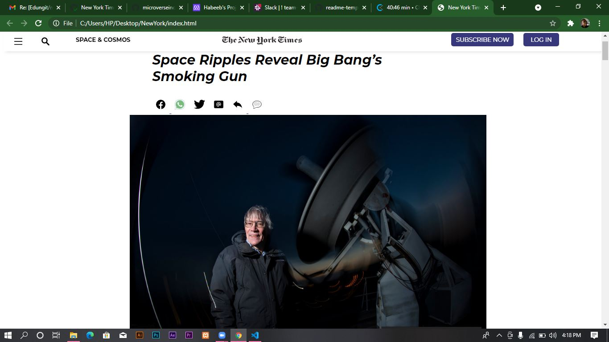
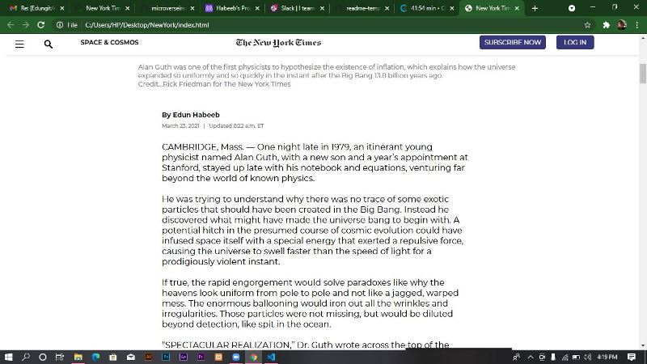
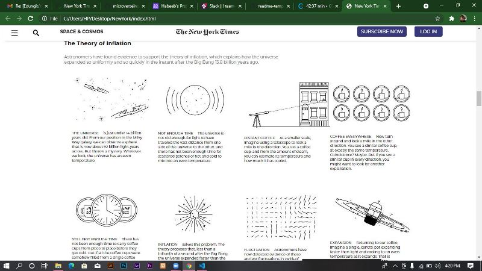
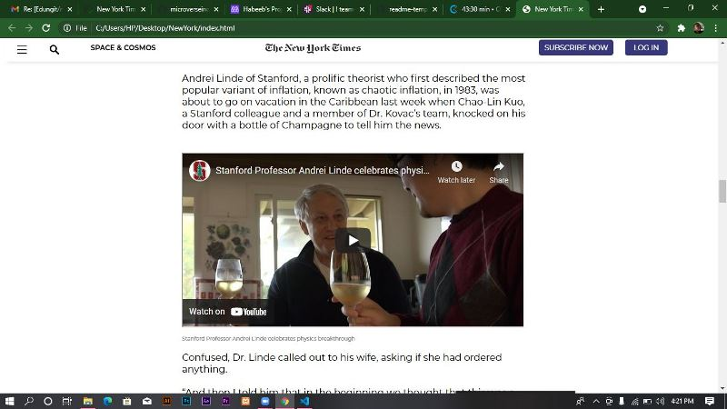
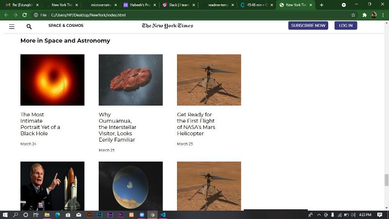
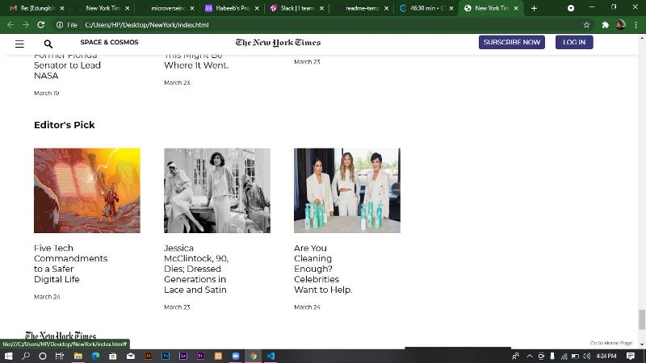

# New York Time Article Page Project

> This is my First Solo Project in Microverse, I am meant to build the mimic of the New York Times Article Page.
>

>
This project is meant to improve our skills of using float, flex and flexbox.

## Built With

- HTML
- CSS

## Live Demo

[Live Demo Link](https://edungit.github.io/new-york-available/)

## Authors

👤 **Author1**

- GitHub: [@Edungit](https://github.com/Edungit)
- Twitter: [@edunnaty](https://twitter.com/edunnaty)
- LinkedIn: [Edun-Habeeb](https://www.linkedin.com/in/edun-habeeb-635680131/)

## 🤝 Contributing

Contributions, issues, and feature requests are welcome!

Feel free to check the [issues page](../../issues/).

## Show your support

Give a ⭐️ if you like this project!

## Acknowledgments

- Hat tip to anyone whose code was used
- Inspiration
- etc

## 📝 License

This project is [MIT](./MIT.md) licensed.